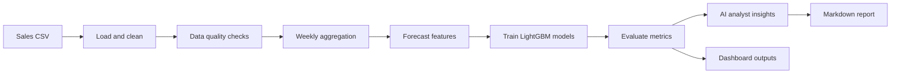

# AI Data Analyst / Demand Forecasting Agent

Professional portfolio project for FMCG demand forecasting, warehouse volume planning, and AI-assisted analytics. The system reads sales data, validates data quality, builds leakage-safe forecasting features, trains weekly demand models, evaluates model performance, and generates business-facing markdown reports.

The project is intentionally runnable without private data. A synthetic sample dataset is included for demo purposes, while raw business data, processed data, model binaries, and generated reports are ignored by Git.

## Problem Statement

Supply chain and commercial planning teams need reliable weekly visibility into product demand and warehouse volume. Late or inaccurate demand signals create labor planning issues, storage bottlenecks, transport inefficiency, and poor peak-season execution.

This project forecasts:

- `total_qty`: weekly shipment quantity.
- `total_cbm`: weekly warehouse/logistics volume.

The agent layer turns a standard forecasting workflow into an analyst-style system that can inspect the dataset, detect quality and leakage risks, summarize model results, and produce a report that a business stakeholder can read.

## Features

- CSV sales data ingestion and cleaning.
- Monday-start weekly aggregation by `category`, `brand`, and `whseid`.
- Data quality checks for missing values, duplicates, invalid dates, date gaps, negative values, outliers, leakage risk, and weekly date alignment.
- Leakage-safe calendar, Vietnam holiday, lag, rolling mean, lag-diff, and lag-pct-change features.
- LightGBM forecasting models for quantity and CBM.
- Time-based train/test split and walk-forward validation.
- Metrics output with MAE, RMSE, WMAPE, and forecast bias.
- AI analyst layer with deterministic mock LLM support and optional OpenAI adapter.
- Markdown report generation for portfolio and stakeholder review.
- CLI and one-command demo runner.
- Streamlit dashboard for planning views.

## Architecture



Text view:

```text
sales data -> quality checks -> weekly features -> train/evaluate -> insights -> reports/dashboard
```

## Quick Demo

Install dependencies:

```powershell
pip install -r requirements.txt
```

Run the full portfolio demo:

```powershell
python scripts/run_demo.py
```

The demo runs `analyze -> train -> report` using `configs/default.yaml` and prints:

```text
outputs/data_quality_report.json
reports/metrics.json
outputs/reports/forecast_report.md
```

## CLI Commands

Run each pipeline stage independently:

```powershell
python -m src.cli analyze --config configs/default.yaml
python -m src.cli train --config configs/default.yaml
python -m src.cli report --config configs/default.yaml
```

Legacy script entrypoints are still available:

```powershell
python src/preprocess.py
python src/train_model.py
python src/make_figures.py
streamlit run app/dashboard.py
```

Run tests:

```powershell
pytest -q
```

## AI Agent Capabilities

The agent module lives in `src/agent/` and exposes:

- `analyze_dataset()`: summarizes rows, columns, date range, and target volume.
- `check_data_quality()`: returns structured quality results.
- `explain_forecast_results()`: converts forecast metrics into business language.
- `generate_business_insights()`: creates concise operational insights.
- `suggest_next_actions()`: recommends follow-up actions.
- `generate_markdown_report()`: writes a stakeholder-ready markdown report.

The default `MockLLM` is deterministic and works offline, making the project testable and safe for GitHub. `OpenAILLM` is included as an optional adapter for real LLM integration when `OPENAI_API_KEY` is configured.

## Data Quality Checks

The quality layer in `src/data/quality.py` reports:

- Missing values.
- Duplicate rows.
- Invalid dates.
- Date gaps by configured group columns.
- Negative sales/quantity values.
- IQR-based outliers.
- Train/test leakage risk.
- Monday alignment for `week_start`.

Outputs are available as JSON and markdown-friendly summaries.

## Metrics

The pipeline reports:

- **MAE**: mean absolute error.
- **RMSE**: root mean squared error.
- **WMAPE**: weighted mean absolute percentage error.
- **Forecast Bias**: `(predicted_sum - actual_sum) / actual_sum`.

WMAPE and bias are emphasized because they are easy for supply chain teams to interpret during planning reviews.

## Project Structure

```text
demand_forecast/
|-- app/
|   |-- dashboard.py
|   `-- dashboard_utils.py
|-- configs/
|   `-- default.yaml
|-- data/
|   |-- raw/
|   |-- sample/
|   `-- processed/
|-- docs/
|   `-- assumptions.md
|-- models/
|-- notebooks/
|-- outputs/
|   `-- reports/
|-- reports/
|   `-- figures/
|-- scripts/
|   `-- run_demo.py
|-- src/
|   |-- agent/
|   |-- data/
|   |-- evaluation/
|   |-- models/
|   |-- reports/
|   |-- utils/
|   |-- cli.py
|   |-- evaluate.py
|   |-- features.py
|   |-- preprocess.py
|   |-- train_model.py
|   `-- validation.py
|-- tests/
|   |-- test_agent_capabilities.py
|   `-- test_pipeline.py
|-- .env.example
|-- config.yaml
|-- pytest.ini
|-- requirements.txt
`-- README.md
```

## Main Outputs

- `data/processed/sales_cleaned.csv`
- `data/processed/weekly_sales.csv`
- `data/processed/model_frame_total_qty.csv`
- `data/processed/model_frame_total_cbm.csv`
- `data/processed/predictions_total_qty.csv`
- `data/processed/predictions_total_cbm.csv`
- `models/lightgbm_total_qty.pkl`
- `models/lightgbm_total_cbm.pkl`
- `reports/metrics.json`
- `reports/metrics_*_by_*.csv`
- `reports/walk_forward_*.csv`
- `outputs/data_quality_report.json`
- `outputs/reports/forecast_report.md`

Generated outputs, model files, cache files, and private raw data are excluded from Git.

## Configuration

`configs/default.yaml` controls:

- input path
- date, week start, target, and grouping columns
- forecast horizon and test split date
- model hyperparameters
- output and report paths

The default config uses `data/sample/synthetic_sales.csv` so the repository can be demonstrated without private data. See `docs/assumptions.md` for implementation assumptions.

## Dashboard

The Streamlit dashboard provides:

- Forecast QTY and CBM KPI cards.
- Forecast bias and WMAPE status.
- CBM peak alert with configurable capacity threshold.
- High-uncertainty brand segments.
- Actual vs forecast chart, CBM by warehouse, and weekly forecast plan.

```powershell
streamlit run app/dashboard.py
```

## Limitations

- This is a portfolio-grade system, not a fully managed production platform.
- Forecasting is one-week-ahead, not a full recursive multi-horizon planning engine.
- Holiday dates are manually maintained for 2023-2025.
- The sample dataset is synthetic and should not be used to claim real-world model performance.
- Price, promotion, stockout, customer/channel, SKU hierarchy, and warehouse capacity constraints are not included by default.
- There is no model registry, drift monitoring, scheduled retraining, or orchestration layer yet.
- The AI layer uses deterministic mock output unless an external LLM adapter is configured.

## Future Work

- Add direct or recursive multi-horizon forecasting.
- Add promotion, price, stockout, customer/channel, and SKU hierarchy features.
- Add MLflow or another model registry.
- Add drift monitoring and scheduled retraining with Airflow or Prefect.
- Add Great Expectations or Pandera contracts for stronger data validation.
- Add richer report sections for segment-level root cause analysis.
- Add CI with linting, type checking, tests, and artifact validation.
