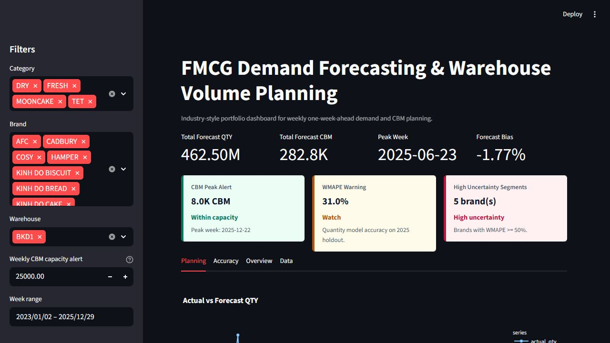
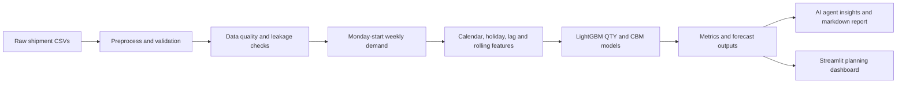

# FMCG Demand Forecasting & Warehouse Volume Planning

Industry-style portfolio project for weekly FMCG demand forecasting and warehouse/logistics volume planning. The project uses shipment history to forecast both quantity and CBM so supply chain planners can identify high-demand weeks, warehouse load, and forecast accuracy by business segment.

The project has been upgraded into an **AI Data Analyst / Forecasting Agent**: a deterministic, testable agent layer can inspect sales data, run data quality checks, flag leakage/anomaly risks, train/evaluate forecasts, generate business insights, and write markdown reports.

## Business Problem

FMCG manufacturers need weekly visibility into demand and warehouse volume to plan labor, storage, transport capacity, and peak-season execution. This project forecasts:

- `total_qty`: weekly shipment quantity.
- `total_cbm`: weekly warehouse/logistics volume.

The dashboard turns model output into a planning view: forecast QTY, forecast CBM, peak week, forecast bias, WMAPE by brand, CBM by warehouse, and weekly forecast plan.

## Dashboard Preview



## Dataset Fields

Raw CSV files are expected in `data/raw/` and contain:

- `ACTUALSHIPDATE`: shipment date.
- `CATEGORY`: product category.
- `WHSEID`: warehouse identifier.
- `BRAND`: product brand.
- `Total QTY`: shipped quantity.
- `Total CBM`: shipment volume.
- `Week`, `Day`: optional calendar fields from the source system.

Raw data, processed data, models, and report outputs are excluded from Git to avoid exposing private business data.

A small synthetic sample is included at `data/sample/synthetic_sales.csv` for structure reference only. It is not used to claim model performance.

## Architecture Diagram



Text view:

```text
sales data -> quality checks -> weekly features -> train/evaluate -> insights -> reports/API-style CLI
```

## Dashboard Features

- Forecast QTY and CBM KPI cards.
- Forecast bias and WMAPE warning.
- CBM peak alert with configurable weekly capacity threshold.
- High-uncertainty brand segments based on WMAPE.
- Actual vs forecast chart, CBM by warehouse, and weekly forecast plan.

## AI Agent Features

- `analyze_dataset()` summarizes rows, columns, date range, and target volume.
- `check_data_quality()` checks missing values, duplicates, invalid dates, date gaps, negative sales, outliers, leakage risk, and Monday week starts.
- `explain_forecast_results()` translates metrics into business-facing language.
- `generate_business_insights()` creates concise operational insights.
- `suggest_next_actions()` recommends follow-up work.
- `generate_markdown_report()` writes a portfolio-ready report to `outputs/reports/`.

The default agent uses `MockLLM`, so it runs offline and is stable in tests. `OpenAILLM` is available as an optional adapter when `openai` and `OPENAI_API_KEY` are configured.

## Project Architecture

```text
demand_forecast/
|-- app/
|   |-- dashboard.py
|   `-- dashboard_utils.py
|-- configs/
|   `-- default.yaml
|-- data/
|   |-- raw/
|   |-- sample/
|   `-- processed/
|-- docs/
|   `-- assumptions.md
|-- models/
|-- outputs/
|   `-- reports/
|-- reports/
|   `-- figures/
|-- src/
|   |-- agent/
|   |-- data/
|   |-- evaluation/
|   |-- models/
|   |-- reports/
|   |-- utils/
|   |-- cli.py
|   |-- evaluate.py
|   |-- features.py
|   |-- holidays.py
|   |-- make_figures.py
|   |-- preprocess.py
|   |-- train_model.py
|   `-- validation.py
|-- tests/
|   `-- test_pipeline.py
|-- config.yaml
|-- .env.example
|-- requirements.txt
`-- README.md
```

## Methodology

1. Load yearly CSV files from `data/raw/`.
2. Validate required columns and date parsability.
3. Clean shipment date, category, brand, warehouse, QTY, and CBM fields.
4. Drop rows with missing critical values and remove duplicate business-key rows.
5. Aggregate daily shipments into Monday-start weekly series by `category + brand + whseid`.
6. Create leakage-safe calendar, Vietnam holiday, lag, rolling mean, lag-diff, and lag-pct-change features.
7. Train LightGBM global regression models for `total_qty` and `total_cbm`.
8. Evaluate on a time-based holdout and walk-forward validation.
9. Publish metrics, segment breakdowns, predictions, models, and Streamlit dashboard.

## Forecast Horizon

The current model is a **one-week-ahead forecast**. Lag and rolling features use actual historical values available before the forecast week. It is not yet a recursive multi-week forecast engine.

## Leakage Handling

The original leakage-prone current-period features were removed:

- `total_qty_diff_1`
- `total_qty_pct_change_1`

The replacement features are shifted into the past:

- `total_qty_lag_diff_1 = lag_1 - lag_2`
- `total_qty_lag_pct_change_1 = (lag_1 - lag_2) / lag_2`

The same logic is applied to `total_cbm`. This prevents the model from reconstructing the current target from current-period differences.

## Validation Strategy

- Time-based test split: configured in `config.yaml` with `test_start_date`.
- Walk-forward validation: simple rolling cutoffs on the training period.
- Segment metrics are generated by brand, category, warehouse, and peak/non-peak season.

## Metrics

The pipeline reports:

- MAE
- RMSE
- WMAPE
- Forecast Bias: `(predicted_sum - actual_sum) / actual_sum`

WMAPE and bias are emphasized because they are interpretable for supply chain planning.

## How to Run

Install dependencies:

```powershell
pip install -r requirements.txt
```

Run the agent CLI with the sample config:

```powershell
python -m src.cli analyze --config configs/default.yaml
python -m src.cli train --config configs/default.yaml
python -m src.cli report --config configs/default.yaml
```

Run preprocessing:

```powershell
python src/preprocess.py
```

Train and evaluate models:

```powershell
python src/train_model.py
```

Generate report figures:

```powershell
python src/make_figures.py
```

Run tests:

```powershell
python -m pytest -q -p no:cacheprovider
```

Start dashboard:

```powershell
streamlit run app/dashboard.py
```

## Sample CLI Output

```text
Saved analysis report to outputs/data_quality_report.json
Saved metrics to reports/metrics.json
Saved markdown report to outputs/reports/forecast_report.md
```

## Main Outputs

- `data/processed/sales_cleaned.csv`
- `data/processed/weekly_sales.csv`
- `data/processed/model_frame_total_qty.csv`
- `data/processed/model_frame_total_cbm.csv`
- `data/processed/predictions_total_qty.csv`
- `data/processed/predictions_total_cbm.csv`
- `models/lightgbm_total_qty.pkl`
- `models/lightgbm_total_cbm.pkl`
- `reports/metrics.json`
- `reports/metrics_*_by_*.csv`
- `reports/walk_forward_*.csv`
- `outputs/data_quality_report.json`
- `outputs/reports/forecast_report.md`

## Configuration

`configs/default.yaml` controls:

- input path
- date, week start, target, and grouping columns
- forecast horizon and test split date
- model hyperparameters
- output and report paths

The default config uses `data/sample/synthetic_sales.csv` so the project can be demonstrated without private data. See `docs/assumptions.md` for assumptions and production notes.

## Limitations

- This is an industry-style portfolio project, not a full production enterprise system.
- The forecast is one-week-ahead, not full multi-week capacity simulation.
- Holiday dates are manually maintained for 2023-2025.
- The model does not include price, promotion, stockout, customer/channel, SKU-level hierarchy, or warehouse capacity constraints.
- There is no orchestration layer, model registry, drift monitoring, or automated retraining yet.
- The AI layer is deterministic by default and does not call an external LLM unless the optional OpenAI adapter is wired in.

## Next Improvements

- Add recursive/direct multi-horizon forecasting.
- Add promotion, price, stockout, and customer/channel features.
- Add data quality reports with Pandera or Great Expectations.
- Add MLflow or another model registry.
- Add capacity thresholds and overload alerts in the dashboard.
- Add scheduled retraining with Airflow or Prefect.
